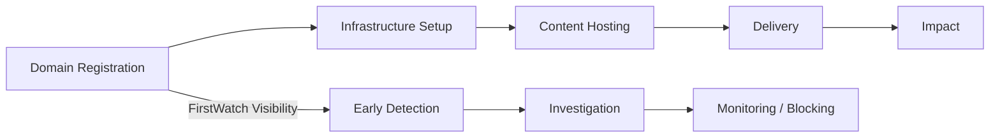

# 🛰️ FirstWatch™
### Malicious Domain Registration Monitoring & Early-Stage Threat Intelligence

> **Detect threats at domain creation — not after damage is done.**

---

## 🔍 Overview

**FirstWatch™** is a domain registration monitoring and WHOIS intelligence solution that provides **early visibility into newly registered and potentially abusive domains**.

Many cyber threats — including **phishing, malware delivery, fraud, and brand impersonation** — rely on domains registered shortly before use. Traditional reputation-based security controls typically identify these domains **only after abuse has already occurred**.

FirstWatch shifts detection **upstream in the threat lifecycle**, enabling organizations to identify, investigate, and operationalize intelligence on suspicious domains at the **earliest possible stage**.

---

## ✨ Why Use FirstWatch?

FirstWatch focuses on **domain creation and registration behavior**, rather than waiting for domains to accumulate negative reputation.

Organizations use FirstWatch to:

- 🆕 Monitor newly registered and high-risk domains
- 🧬 Identify brand impersonation and typo‑squatting
- 🎯 Detect infrastructure linked to phishing, fraud, and malware
- 🧾 Enrich investigations with WHOIS, registrar, and nameserver context
- 🔄 Integrate early indicators into security, intelligence, and automation workflows

---

## 🤖 What the Automation Script Provides

The **FirstWatch API** delivers domain intelligence at scale.  
This automation script operationalizes that data for:

- Security Operations Centers (SOC)
- SOAR platforms
- Threat intelligence teams
- Brand protection and fraud teams
- Research and analytics workflows

---

## 🚀 Core Capabilities

### 🔎 Domain Discovery
- Exact domain lookup
- Fuzzy matching for look‑alike and typo‑squatted domains
- Automatic exact → fuzzy fallback

### 📤 Output Formats
- **CSV** – Analyst review and reporting
- **JSON / JSONL** – Automation pipelines
- **STIX 2.1** – Threat intelligence platforms

### 🧠 Threat Intelligence Integration
- STIX `domain-name` and `indicator` objects
- Configurable **TLP markings**
- Classification labels (`malicious`, `benign`, `anomalous`)
- Original FirstWatch enrichment preserved

### ⚙️ Operational Reliability
- JWT authentication with auto‑refresh
- Rate‑limit‑aware retries
- Optional quota validation
- Streaming output for large datasets

---

## ⚡ Quick Start

### Prerequisites
- Python **3.9+**
- FirstWatch API key

### Clone
```bash
git clone https://github.com/whois-api-llc/ProfessionalServices.git
cd ProfessionalServices/scripts/firstwatch/advanced
```

### Install
```bash
pip install -r requirements.txt
```

### Configure
```yaml
auth:
  api_key: YOUR_API_KEY

output:
  format: stix
  directory: ./output

stix:
  tlp: AMBER
  classification: malicious

search:
  mode: auto
  fuzzy_threshold: 0.85

runtime:
  validate_quota: true
  rate_limit_retries: 3
```

### Run
```bash
python firstwatch.py --input domains.txt
```

---

## ⚙️ Configuration Reference

| Section | Key | Type | Description |
|------|----|----|----|
| auth | api_key | string | FirstWatch API key |
| output | format | string | csv \| json \| jsonl \| stix |
| output | directory | string | Output directory |
| stix | tlp | string | CLEAR / GREEN / AMBER / RED |
| stix | classification | string | Indicator classification |
| search | mode | string | exact / fuzzy / auto |
| search | fuzzy_threshold | float | Similarity threshold |
| runtime | validate_quota | bool | Validate API quota |
| runtime | rate_limit_retries | int | Retry attempts |

---

## ⏳ Threat Lifecycle Coverage



---

## ⚖️ FirstWatch vs Reputation‑Based Detection

| Capability | FirstWatch™ | Reputation Systems |
|---------|-------------|-------------------|
| Detection Timing | At registration | Post‑abuse |
| Brand Abuse | ✅ Yes | ❌ Late |
| Typo‑Squatting | ✅ Yes | ❌ Limited |
| WHOIS Context | ✅ Native | ⚠️ Partial |
| STIX Output | ✅ Yes | ⚠️ Varies |
| Proactive Hunting | ✅ Yes | ❌ No |

---

## 🎯 MITRE ATT&CK Alignment

### Primary Tactics
- **TA0043 – Reconnaissance**
- **TA0042 – Resource Development**

### Techniques
- **T1583.001 – Domains**
- **T1583.003 – DNS Providers**
- **T1566 – Phishing**
- **T1071.004 – DNS (C2 context)**

---

## 🗺️ ATT&CK Navigator Layer (Example)

```json
{
  "name": "FirstWatch Early Infrastructure Coverage",
  "domain": "enterprise-attack",
  "description": "Early-stage domain registration intelligence",
  "techniques": [
    {
      "techniqueID": "T1583.001",
      "tactic": "resource-development",
      "color": "#4CAF50"
    },
    {
      "techniqueID": "T1583.003",
      "tactic": "resource-development",
      "color": "#4CAF50"
    },
    {
      "techniqueID": "T1566",
      "tactic": "initial-access",
      "color": "#FFC107"
    }
  ]
}
```

---

## 📁 Sample STIX 2.1 Bundle

```json
{
  "type": "bundle",
  "objects": [
    {
      "type": "domain-name",
      "value": "login-paypa1[.]com"
    },
    {
      "type": "indicator",
      "labels": ["malicious", "phishing", "brand-impersonation"],
      "confidence": 70
    }
  ]
}
```

---

## 📊 SOAR Playbooks (Reference)

### Early Phishing Detection
- Ingest FirstWatch STIX
- Apply confidence thresholds
- Enrich with DNS & WHOIS
- Watchlist or alert SOC

### Infrastructure Expansion
- Pivot from known IOC
- Fuzzy match related domains
- Cluster by registrar & nameserver

### Monitoring vs Enforcement
- Monitor newly registered domains
- Enforce only after corroboration

---

## 📦 Vendor‑Specific SOAR Playbooks

### 🟦 Cortex XSOAR
- STIX ingestion
- Brand correlation
- Incident creation
- Confidence‑gated blocking

### 🟧 Splunk SOAR
- Risk scoring
- Watchlisting
- Corroborated blocking
- Campaign clustering

---

## 🧱 Deployment Models

### SOC
Early phishing and fraud detection

### SOAR
Automation‑first enrichment and response

### Research
Campaign tracking and infrastructure analysis

### MSSP
Multi‑tenant early warning and brand protection

---


---

## 📦 Ready-to-Customize Artifacts

This repo includes **reference artifacts** you can import or adapt for common SOAR platforms.

### Cortex XSOAR (Playbook YAML Templates)
- `xsoar_playbook_firstwatch_early_phishing.yml` — STIX ingestion → enrichment → confidence gates → watchlist/block
- `xsoar_playbook_firstwatch_ioc_pivot.yml` — seed IOC → FirstWatch fuzzy search → clustering → investigation summary

- `xsoar_playbook_firstwatch_monitor_vs_enforce.yml` — conservative Monitor vs Enforce workflow with corroboration and optional analyst approval
- `splunk_soar_playbook_firstwatch_monitor_vs_enforce_skeleton.json` — Splunk SOAR (Phantom) playbook JSON skeleton demonstrating custom function call + routing


### Splunk SOAR (Phantom) Custom Function
- `phantom_custom_function_firstwatch_risk_score.py` — explainable risk scoring for newly registered domains (auditable reasons)

> These templates are intentionally conservative and include **placeholders** for integration command names (e.g., `dns-resolve`, `whois`, `block-domain`).
> Replace placeholders with the commands available in your environment (Palo Alto DNS Security, Proofpoint, Zscaler, Infoblox, Splunk ES, etc.).

## 🔐 Security Considerations

- Treat API keys as secrets
- Apply TLP markings appropriately
- Use indicators as early signals, not verdicts
- Avoid blind enforcement
- Secure logs and output data

---

## 🧠 Summary

**FirstWatch™** delivers early, actionable domain intelligence at the moment of registration — where many security stacks traditionally lack visibility.

By combining:
- Domain monitoring
- WHOIS intelligence
- STIX‑ready automation
- MITRE ATT&CK alignment

FirstWatch enables organizations to **detect, investigate, and disrupt threats before they go live**.

> **FirstWatch™ — Intelligence at the moment of registration.**
